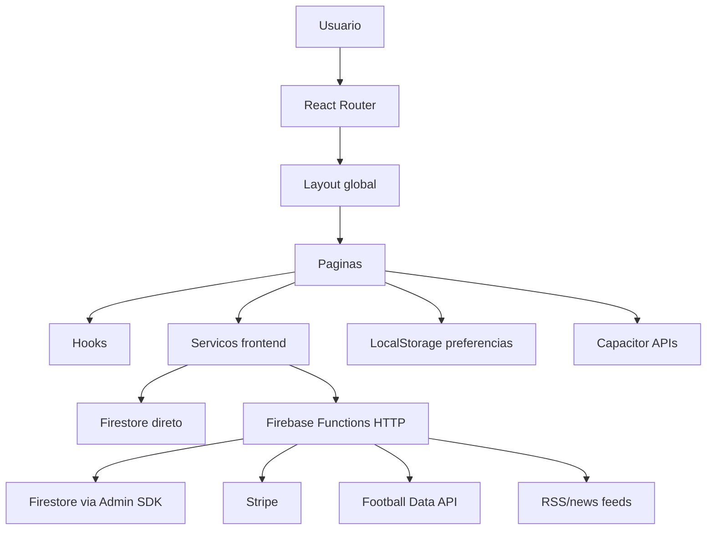
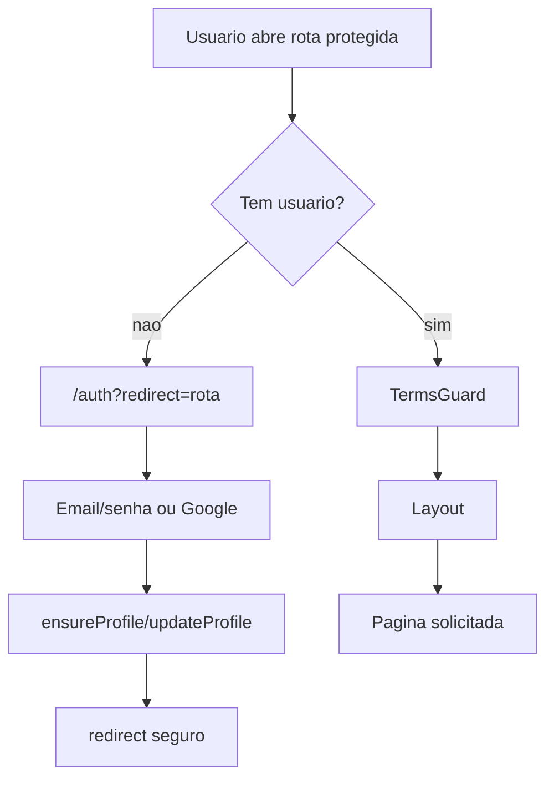
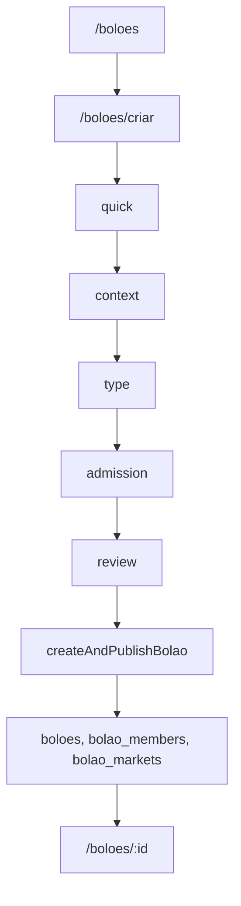
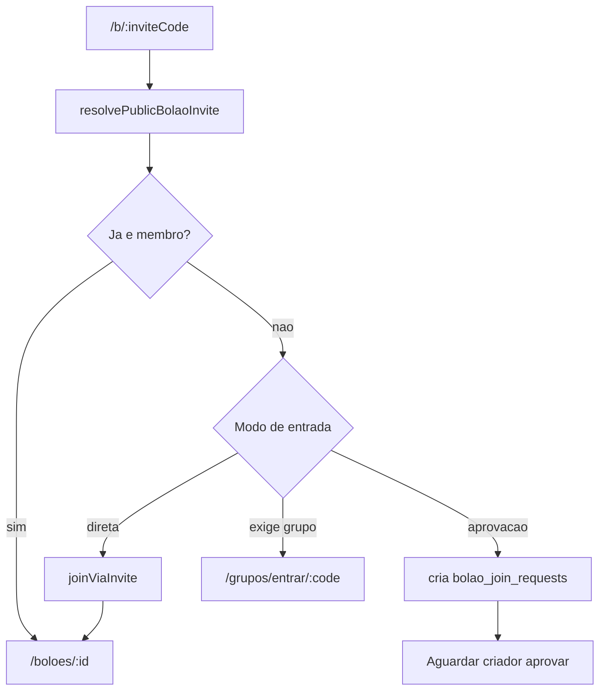
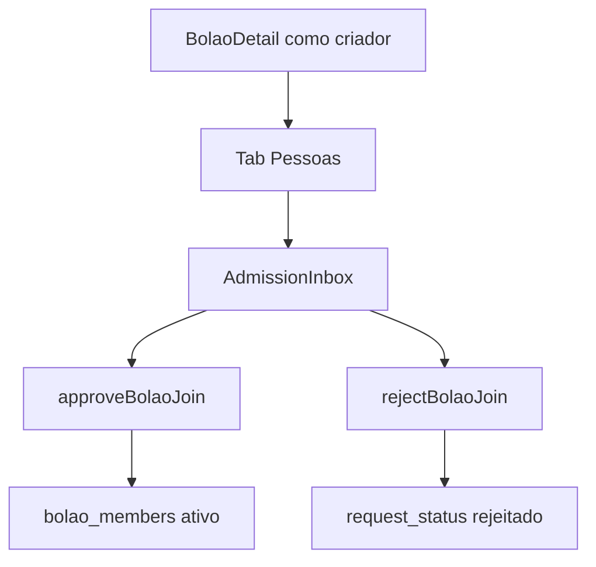
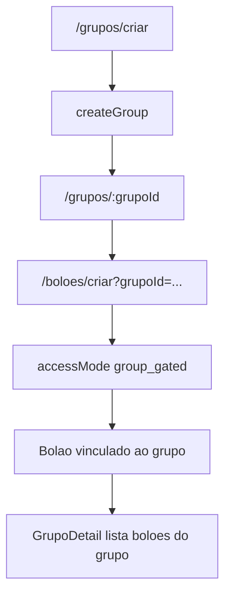
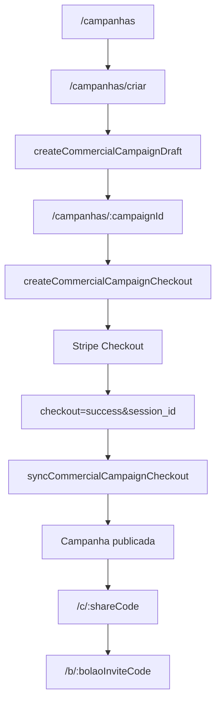
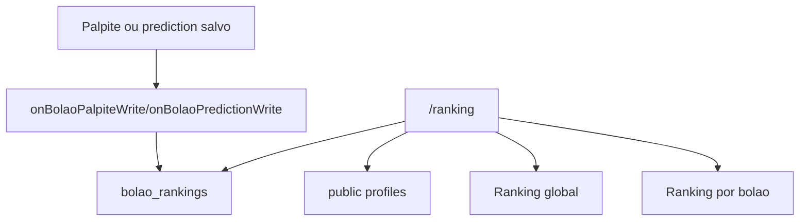
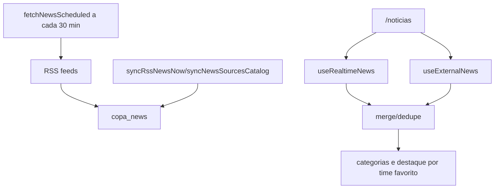
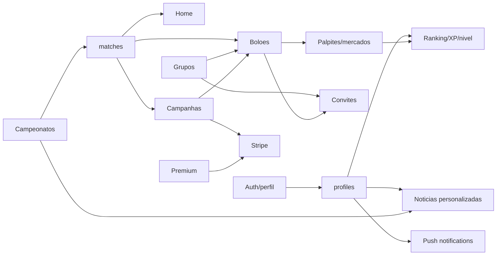

# ArenaCUP - mapa funcional completo do app

Documento gerado a partir da leitura do codigo-fonte em `src/`, `functions/`, `public/` e arquivos de configuracao do projeto.

## Sumario

- [1. Visao geral](#1-visao-geral)
- [2. Stack e camadas](#2-stack-e-camadas)
- [3. Arvore do projeto](#3-arvore-do-projeto)
- [4. Bootstrap e hierarquia global](#4-bootstrap-e-hierarquia-global)
- [5. Mapa de rotas](#5-mapa-de-rotas)
- [6. Menus e navegacao](#6-menus-e-navegacao)
- [7. Areas funcionais](#7-areas-funcionais)
- [8. Fluxos principais](#8-fluxos-principais)
- [9. Interrelacoes entre modulos](#9-interrelacoes-entre-modulos)
- [10. Dados, colecoes e servicos](#10-dados-colecoes-e-servicos)
- [11. Cloud Functions e backend](#11-cloud-functions-e-backend)
- [12. Links publicos, legados e deep links](#12-links-publicos-legados-e-deep-links)
- [13. Componentes transversais](#13-componentes-transversais)
- [14. Testes e documentacao existente](#14-testes-e-documentacao-existente)

## 1. Visao geral

O ArenaCUP e um app React/Vite com Firebase, Capacitor e i18n, focado em competicoes de futebol, boloes, grupos sociais, ranking, noticias e campanhas comerciais para negocios. A arquitetura combina:

- Aplicacao web/mobile em React.
- Autenticacao Firebase.
- Firestore como banco principal.
- Firebase Cloud Functions como camada de operacoes sensiveis, integracoes, ranking, convites, Stripe, campanhas comerciais e ingestao de noticias.
- Capacitor para recursos mobile como deep links, compartilhamento, push notifications, haptics, geolocalizacao e apps Android/iOS.
- React Query para cache de consultas.
- i18next com namespaces em `public/locales`.
- shadcn/Radix UI, Tailwind e componentes proprios da arena.

O app e protegido por login na maior parte das rotas. Convites publicos, campanhas publicas e paginas legais ficam fora do `ProtectedRoute`.

## 2. Stack e camadas

### Frontend

- `React 18`
- `Vite`
- `TypeScript`
- `react-router-dom`
- `@tanstack/react-query`
- `TailwindCSS`
- `Radix UI` e componentes `src/components/ui`
- `framer-motion`
- `lucide-react`
- `i18next` e `react-i18next`

### Mobile/PWA

- `@capacitor/core`, `android`, `ios`
- `@capacitor/app` para deep links
- `@capacitor/share` para compartilhamento
- `@capacitor/push-notifications`
- `@capacitor/geolocation`
- `@capacitor/haptics`
- Service worker/PWA via componentes de banner e push.

### Backend

- Firebase Auth
- Firestore
- Firebase Storage
- Firebase Cloud Functions
- Stripe Checkout
- Football-data.org para seed/sincronizacao de ligas
- RSS feeds para noticias

### Organizacao de responsabilidades



## 3. Arvore do projeto

Arvore funcional resumida, sem `node_modules`, `dist` e artefatos binarios:

```text
Arenacopa/
├─ android/                         # Projeto Android Capacitor
├─ ios/                             # Projeto iOS Capacitor
├─ docs/                            # Documentacao tecnica e planos
│  ├─ news-*.md
│  ├─ sistema-boloes.md
│  └─ superpowers/
├─ functions/                       # Firebase Cloud Functions
│  ├─ index.js                      # Entrypoint das functions
│  ├─ newsSources.js
│  ├─ bolao-config/
│  ├─ bolao-listing/
│  ├─ commercial-campaigns/
│  ├─ group-access/
│  └─ test/
├─ public/
│  ├─ assets/arena/                 # Assets visuais da marca/arena/ligas
│  ├─ images/championships/
│  ├─ images/flags/
│  ├─ images/teams/
│  └─ locales/
│     ├─ pt-BR/
│     ├─ en/
│     └─ es/
├─ scripts/                         # Scripts auxiliares
├─ src/
│  ├─ App.tsx                       # Providers, router, guards e rotas
│  ├─ main.tsx                      # Mount React
│  ├─ index.css                     # Estilos globais/Tailwind
│  ├─ components/
│  │  ├─ Layout.tsx                 # Header, sidebar, bottom tabs, footer
│  │  ├─ MobileMenuSheet.tsx        # Menu mobile bottom sheet
│  │  ├─ NotificationsSheet.tsx
│  │  ├─ OnboardingModal.tsx
│  │  ├─ TermsGuard.tsx
│  │  ├─ arena/                     # Primitivos visuais Arena
│  │  ├─ copa/                      # Componentes Copa/bolao
│  │  ├─ home/
│  │  ├─ profile/
│  │  ├─ ranking/
│  │  └─ ui/                        # shadcn/Radix wrappers
│  ├─ config/
│  │  └─ navigation.ts              # Itens da navegacao principal
│  ├─ contexts/
│  │  ├─ AuthContext.tsx
│  │  ├─ ChampionshipContext.tsx
│  │  ├─ MonetizationContext.tsx
│  │  └─ SimulacaoContext.tsx
│  ├─ data/
│  │  ├─ bolaoFormats.ts
│  │  ├─ bolaoMarketTemplates.ts
│  │  ├─ guiaData.ts
│  │  ├─ historiaData.ts
│  │  ├─ mockData.ts
│  │  ├─ sedesData.ts
│  │  └─ championships/definitions.ts
│  ├─ features/
│  │  ├─ boloes/
│  │  │  ├─ create/
│  │  │  ├─ edit/
│  │  │  ├─ listing/
│  │  │  └─ shared/
│  │  ├─ groups/
│  │  └─ social/
│  ├─ hooks/
│  ├─ i18n/
│  ├─ integrations/
│  │  └─ firebase/client.ts
│  ├─ lib/
│  │  ├─ analytics/
│  │  ├─ commercial-campaign*.ts
│  │  ├─ match-feed.ts
│  │  ├─ profile-level.ts
│  │  └─ security.ts
│  ├─ pages/
│  ├─ services/
│  ├─ test/
│  ├─ types/
│  └─ utils/
├─ firestore.rules
├─ firestore.indexes.json
├─ storage.rules
├─ firebase.json
├─ capacitor.config.ts
├─ package.json
└─ vite.config.ts
```

## 4. Bootstrap e hierarquia global

### Ordem de inicializacao

`src/App.tsx` monta a aplicacao nesta ordem:

1. `QueryClientProvider`
2. `TooltipProvider`
3. Toasters (`Toaster` e `Sonner`)
4. `AuthProvider`
5. `MonetizationProvider`
6. `ChampionshipProvider`
7. `Suspense` com `LoadingScreen`
8. `LanguageRuntime`
9. `FieldBackground`
10. `AppSplash`
11. `BrowserRouter`
12. `DeepLinkListener`
13. `PushNotificationListener`
14. `ScrollToTop`
15. `AppRoutes`

### Guards globais

- `ProtectedRoute`: exige usuario autenticado. Se nao houver usuario, redireciona para `/auth?redirect=...`.
- `AuthRoute`: se o usuario ja estiver logado, redireciona para o redirect seguro ou `/`.
- `TermsGuard`: aplicado dentro das rotas protegidas.
- `sanitizeInternalRedirect`: previne redirects externos/inseguros.
- `lazyWithReloadRetry`: recarrega a pagina uma vez se houver erro de chunk dinamico.

### Layout global

Rotas protegidas de app usam:

```text
ProtectedRoute
└─ Layout
   ├─ CookieBanner
   ├─ OnboardingModal
   ├─ AppSidebar desktop
   ├─ Header
   │  ├─ Logo/wordmark ou botao voltar
   │  ├─ Titulo contextual
   │  ├─ NotificationsSheet
   │  └─ Avatar/atalho Perfil
   ├─ main scrollavel
   │  └─ pagina atual
   ├─ Footer
   │  ├─ /termos
   │  ├─ /privacidade
   │  └─ mailto:contato@arenacup.com
   ├─ BottomTabs mobile
   └─ PWABanner
```

O bottom nav mobile e escondido em `/boloes/criar`.

## 5. Mapa de rotas

### Rotas publicas

| Rota | Pagina | Finalidade |
|---|---|---|
| `/auth` | `Auth` | Login/cadastro por email/senha ou Google. |
| `/b/:inviteCode` | `PublicInvite` | Convite publico para bolao. |
| `/c/:shareCode` | `PublicCommercialCampaign` | Link publico/QR de campanha comercial. |
| `/grupos/entrar/:inviteCode` | `PublicGroupInvite` | Convite publico para grupo. |
| `/privacidade` | `Privacidade` | Politica de privacidade. |
| `/termos` | `Termos` | Termos de uso. |
| `/excluir-conta` | `ExcluirConta` | Solicitacao/instrucao publica de exclusao de conta. |
| `/privacy` | redirect | Redireciona para `/privacidade`. |
| `/terms` | redirect | Redireciona para `/termos`. |

### Rotas protegidas principais

| Rota | Pagina | Area |
|---|---|---|
| `/` | `Index` | Home/dashboard do usuario. |
| `/campeonatos` | `Campeonatos` | Seletor de campeonatos. |
| `/campeonato/:championshipId` | `CampeonatoHub` | Hub de campeonato que nao seja Copa 2026. |
| `/copa` | `Copa` | Hub Copa 2026. |
| `/copa/:subtab` | `Copa` | Abas internas da Copa. |
| `/copa/guia` | `Guia` | Guia de sedes/cidades. |
| `/copa/guia/:subtab` | `Guia` | Subaba mapa. |
| `/boloes` | `Boloes` | Lista, descoberta e entrada em boloes. |
| `/boloes/rapido` | `BolaoRapido` | Criacao expressa de bolao de jogo unico. |
| `/boloes/criar` | `CriarBolao` | Wizard de criacao de bolao. |
| `/boloes/:id` | `BolaoDetail` | Detalhe de bolao. |
| `/grupos` | `Grupos` | Lista, convites e entrada em grupos. |
| `/grupos/criar` | `CriarGrupo` | Wizard de criacao de grupo. |
| `/grupos/:grupoId` | `GrupoDetail` | Detalhe de grupo. |
| `/ranking` | `Ranking` | Ranking global e por bolao. |
| `/noticias` | `Noticias` | Feed de noticias. |
| `/perfil` | `Perfil` | Perfil, notificacoes, time favorito e configuracoes. |
| `/menu` | `Menu` | Menu completo de conta/suporte. |
| `/regras` | `Rules` | Regras de pontuacao. |
| `/premium` | `Premium` | Checkout/estado Premium. |
| `/team/:code` | `TeamDetails` | Detalhes de selecao/time. |
| `*` | `NotFound` | Fallback protegido. |

### Rotas de campanhas comerciais

| Rota | Pagina | Finalidade |
|---|---|---|
| `/bares` | `BaresLanding` | Landing operacional de campanhas para bares/negocios. |
| `/bares/campanhas/criar` | `CriarCampanhaBar` | Criar campanha comercial. |
| `/bares/campanhas/:campaignId` | `CampanhaBarDetail` | Revisao, checkout, QR e compartilhamento. |
| `/campanhas` | `BaresLanding` | Alias de `/bares`. |
| `/campanhas/criar` | `CriarCampanhaBar` | Alias de criacao. |
| `/campanhas/:campaignId` | `CampanhaBarDetail` | Alias de detalhe. |

### Rotas legadas e redirects

| Rota legada | Destino |
|---|---|
| `/news` | `/noticias` |
| `/cup` | `/copa` |
| `/cup/:subtab` | mapeado para tabs atuais da Copa |
| `/simulator` | `/copa/simulacao` |
| `/copas/central` | `/copa` |
| `/criar-bolao` | `/boloes/criar` mantendo query |
| `/pools` | `/boloes` |
| `/pools/create` | `/boloes/criar` mantendo query |
| `/pools/:id` | `/boloes/:id` |
| `/guia` | `/copa/guia` |
| `/guia/historia` | `/copa/historia` |
| `/guia/:subtab` | mapeado para `/copa/guia` ou `/copa/historia` |
| `/guide` | `/copa/guia` |
| `/guide/:subtab` | mapeado para guia atual |
| `/profile`, `/account`, `/conta` | `/perfil` |
| `/rules` | `/regras` |

## 6. Menus e navegacao

### Navegacao principal

Configurada em `src/config/navigation.ts`.

| Item | Path | Mobile | Desktop | Observacoes |
|---|---:|---:|---:|---|
| Home | `/` | sim | sim | Dashboard. |
| Campeonatos | `/campeonatos` | sim | sim | Ativa tambem em `/campeonato/*`. |
| Bolao | `/boloes` | sim | sim | No mobile e FAB central. |
| Grupos | `/grupos` | sim | sim | Area social. |
| Menu | `#menu` | sim | nao | Abre `MobileMenuSheet`. |
| Copa | `/copa` | nao | sim | Ativa tambem em `/copa/*`. |
| Noticias | `/noticias` | nao | sim | Feed de noticias. |
| Perfil | `/perfil` | nao | sim | Conta e preferencias. |

### Header

O header contextual:

- Mostra logo/wordmark em paginas raiz no mobile.
- Mostra botao de voltar quando a rota tem mais de um segmento.
- Mostra titulo em subpaginas de bolao, grupos e perfil.
- Oculta titulo em experiencias imersivas como Home, Copa, Campeonatos, Ranking e Noticias.
- Inclui `NotificationsSheet`.
- Inclui avatar/atalho para `/perfil`.
- Mostra nivel do usuario com `useProfileStats` e `getArenaLevel`.

### Sidebar desktop

Lista os itens com `desktop: true`:

```text
Home
Campeonatos
Bolao
Grupos
Copa
Noticias
Perfil
```

### Bottom tabs mobile

Lista os itens com `mobile: true`:

```text
Home
Campeonatos
Bolao/FAB
Grupos
Menu
```

### Menu mobile bottom sheet

`MobileMenuSheet` abre como sheet inferior com:

```text
Minha Conta
├─ Perfil -> /perfil
├─ Avisos & Noticias -> /noticias
├─ Ranking Geral -> /ranking
└─ Arena Premium -> /premium

Suporte
├─ Regras do Jogo -> /regras
├─ Termos de Uso -> /termos
└─ Privacidade -> /privacidade
```

### Pagina `/menu`

Menu completo em pagina propria:

```text
Perfil -> /perfil
Regras -> /regras
ArenaCup para Bares -> /bares
Notificacoes -> /perfil
Configuracoes -> /perfil
Privacidade -> /privacidade
Ajuda -> /regras
Sair -> signOut + /auth
```

## 7. Areas funcionais

### 7.1 Autenticacao

Pagina: `src/pages/Auth.tsx`

Funcionalidades:

- Alternancia entre login e cadastro.
- Login/cadastro com email e senha.
- Login com Google.
- Aceite obrigatorio de termos no cadastro.
- Criacao/garantia de perfil via `ensureProfile`.
- Atualizacao de nome e aceite de termos.
- Redirecionamento seguro por query `redirect`.

Servicos:

- `services/auth/auth.service.ts`
- `services/profile/profile.service.ts`
- `AuthContext`

### 7.2 Home

Pagina: `src/pages/Index.tsx`

Funcionalidades:

- Hero de palpites pendentes.
- CTA para bolao com pendencias.
- Modal Premium/Elite.
- Jogo em destaque ao vivo ou proximo.
- Resumo de perfil: nivel, pontos, melhor ranking e quantidade de boloes.
- Lista de jogos em destaque.
- Lista de boloes do usuario com status de pendencias.
- Empty state com CTA para criar bolao.

Dados:

- `getDashboardData`
- `useDashboardMatches`
- `usePendingPredictions`
- `useMonetization`

### 7.3 Campeonatos

Paginas:

- `Campeonatos`
- `CampeonatoHub`
- `Copa`
- `Guia`

Funcionalidades:

- Seletor de campeonatos.
- Copa do Mundo 2026 em card destacado.
- Ligas/competicoes: Brasileirao, Libertadores, Premier League, Ligue 1, LaLiga, Bundesliga, Liga Saudita, Champions League, MLS e demais definicoes.
- Persistencia do campeonato ativo em `localStorage`.
- Contagem de boloes ativos por campeonato do usuario.
- Hub de campeonato com jogos, classificacao, noticias e boloes.
- Redirecionamento de `wc2026` para `/copa`.

Abas de `CampeonatoHub`:

```text
Jogos
├─ Ao vivo agora
├─ Proximos jogos
└─ Resultados recentes

Classificacao
├─ Tabela oficial em standings/{championshipId}
└─ Fallback derivado por resultados em matches

Noticias
└─ Feed filtrado por championshipId

Boloes
├─ Criar bolao para o campeonato
└─ Lista de boloes ativos/open do campeonato
```

### 7.4 Copa 2026

Pagina: `src/pages/Copa.tsx`

Abas:

```text
Overview -> /copa
Calendario -> /copa/calendario
Grupos -> /copa/grupos
Chaves -> /copa/chaves
Historia -> /copa/historia
Simulacao -> /copa/simulacao
```

Componentes:

- `CopaOverview`
- `CalendarioTab`
- `GruposTab`
- `ChavesTab`
- `HistoriaTab`
- `SimulacaoTab`
- `SimulacaoProvider`

Relacionamentos:

- Usa dados de times, grupos, calendario e bracket.
- Simulacao usa contexto proprio.
- Noticias da Copa foram movidas para `/noticias`.
- Guia/sedes ficam em `/copa/guia`.

### 7.5 Guia de cidades e mapa

Pagina: `src/pages/Guia.tsx`

Modos:

```text
Lista/Cidades -> /copa/guia
Mapa -> /copa/guia/mapa
```

Componentes:

- `GuiaTab`
- `MapaTab`
- `EstadiosSection`
- Dados em `guiaData.ts`, `sedesData.ts` e `historiaData.ts`.

### 7.6 Boloes

Paginas:

- `Boloes`
- `BolaoRapido`
- `CriarBolao`
- `BolaoDetail`
- `PublicInvite`

Funcionalidades de `/boloes`:

- Lista "Meus boloes".
- Pedidos pendentes do usuario.
- Entrada por codigo de convite.
- Descoberta de boloes publicos.
- CTA para criar bolao da turma.
- CTA para campanha comercial.
- Painel de orientacao de entrada.

Tipos de entrada:

- Direta, quando `join_mode`/`admission_mode` permitem.
- Por solicitacao/aprovacao.
- Obrigatoria via grupo quando o bolao e `group_gated`.

Criacao de bolao:

```text
quick
├─ audiencia: pessoal ou negocio
├─ contexto: standalone, grupo existente ou novo grupo
├─ nome, emoji, descricao e publico social
└─ se negocio, deriva para campanha comercial

context
├─ seleciona/vincula grupo
└─ define modo standalone/existing_group/new_group

type
├─ rapid
├─ complete
└─ paid

admission
├─ public
├─ approval
└─ group_gated

review
└─ cria e publica via Cloud Function
```

Estados do wizard:

- `audienceMode`
- `commercialPlanId`
- `contextMode`
- `selectedGrupoId`
- `accessMode`
- `financeMode`
- `entryFee`
- `paymentDetails`
- `prizeDistribution`
- `selectedTypeId`
- `formatId`
- `selectedMarketIds`
- `scoringRules`
- `scoringMode`
- `name`, `description`, `emoji`
- `socialAudience`
- campos de novo grupo

Detalhe do bolao:

```text
Header
├─ voltar
├─ avatar/nome/descricao
├─ categoria publico/privado
├─ codigo de convite
├─ formato
├─ mercados ativos
├─ editar bolao se criador
├─ apostar campeao se mercado aberto
└─ compartilhar

Resumo de pendencias
├─ jogos pendentes
├─ mercados de fase
├─ mercados de campeonato
└─ especiais

Tabs
├─ Jogos/Palpites
│  ├─ JogosTab
│  ├─ mercados de fase
│  ├─ mercados de campeonato
│  └─ mercados especiais
├─ Ranking
│  └─ RealtimeRankingTab
├─ Pessoas
│  ├─ solicitacoes para entrar, se criador
│  ├─ Rivais/PublicPalpitesTab
│  └─ Membros/MembrosTab
└─ Resumo
   ├─ OverviewTab
   ├─ CaixinhaPanel
   └─ GrupoLinkPanel, se criador
```

Dados em tempo real no detalhe:

- `bolao_members`
- `bolao_join_requests`
- `bolao_palpites`
- `bolao_markets`
- `bolao_predictions`
- `bolao_activity`
- `bolao_onboarding_state`
- `bolao_champion_predictions`

### 7.7 Bolao rapido

Pagina: `src/pages/BolaoRapido.tsx`

Fluxo:

1. Carrega jogos de hoje/proximos 3 dias em `matches`.
2. Usuario escolhe um jogo.
3. Nome do bolao e preenchido automaticamente com mandante x visitante.
4. Cria bolao com formato classico e mercado `score`.
5. Exibe codigo de convite.
6. Compartilha via WhatsApp, Web Share/Capacitor Share ou clipboard.
7. CTA para abrir `/boloes/:id`.

### 7.8 Grupos

Paginas:

- `Grupos`
- `CriarGrupo`
- `GrupoDetail`
- `PublicGroupInvite`

Funcionalidades de `/grupos`:

- Lista grupos em que o usuario participa.
- Mostra grupos administrados.
- Mostra pedidos pendentes.
- Entrada por codigo.
- Copia link de convite para grupos administrados.
- CTA para criar grupo.

Criacao de grupo:

```text
purpose
├─ Turma privada
└─ Comunidade aberta

identity
├─ emoji
├─ nome
└─ descricao

launch
├─ criar grupo primeiro
└─ criar grupo e seguir para bolao
```

Detalhe do grupo:

```text
Header
├─ voltar
├─ nome/emoji/descricao
├─ convidar
├─ criar bolao, se manager
└─ sair do grupo, se membro comum

Conteudo
├─ FeaturedBolaoCard
├─ solicitacoes para entrar, se manager
├─ boloes do grupo
│  ├─ abrir bolao
│  └─ marcar/desmarcar destaque
└─ membros
   ├─ cargo admin/membro
   └─ remover membro, se manager
```

### 7.9 Ranking

Pagina: `src/pages/Ranking.tsx`

Funcionalidades:

- Ranking global agregado a partir de `bolao_rankings`.
- Filtro por bolao do usuario.
- Podio top 3.
- Lista top 50.
- Destaque da posicao do usuario.
- Nivel calculado por pontos.
- Card de progresso/recompensa.

Dados:

- `bolao_rankings`
- `bolao_members`
- `boloes`
- perfis publicos via `getPublicProfilesByIds`.

### 7.10 Perfil

Pagina: `src/pages/Perfil.tsx`

Funcionalidades:

- Avatar com upload.
- Nome, nickname, bio, nascimento, genero e nacionalidade.
- Nivel, XP, pontos, aproveitamento, titulos e placares exatos.
- Conquistas desbloqueadas por estatisticas.
- Historico acumulado.
- Time favorito com seletor.
- Idioma automatico baseado no sistema.
- CTA Premium.
- Preferencias de notificacao:
  - gols
  - noticias
  - inicio de partida
- Push subscription quando ativa notificacoes de gols.
- Apoio/contato.
- Links de ajuda, termos e privacidade.
- Logout.

Dados:

- `profiles`
- `push_subscriptions`
- `useProfileStats`
- `favorite-team` local storage/evento.

### 7.11 Noticias

Pagina: `src/pages/Noticias.tsx`

Funcionalidades:

- Junta feed realtime do Firestore com feeds externos.
- Deduplica por URL/id.
- Ordena por publicacao.
- Categorias:
  - Todos
  - Copa 2026
  - Selecoes
  - Futebol
  - Partidas
  - Viagem
  - Ingressos
- Onboarding inicial para escolher categorias da Home.
- Preferencias persistidas em `localStorage`.
- Painel para personalizar Home.
- Destaque para time favorito.
- Progress bar de carregamento de fontes externas.
- Links externos sanitizados.

Dados:

- `useRealtimeNews`
- `useExternalNews`
- `copa_news`
- `newsSources`

### 7.12 Premium

Pagina: `src/pages/Premium.tsx`

Funcionalidades:

- Mostra status Premium ativo/inativo.
- Exibe pilares de beneficio.
- Exibe preco por env/config.
- Inicia checkout Premium se habilitado.
- Fallback para contato de suporte se checkout estiver desativado.
- Sincroniza retorno de checkout via query:
  - `checkout=success&session_id=...`
  - `checkout=cancelled`
- Suporta simulacao Premium no modo demo.

Backend:

- `createPremiumCheckoutSession`
- `syncPremiumCheckoutSession`
- `premium_subscriptions`

### 7.13 Regras

Pagina: `src/pages/Rules.tsx`

Conteudo:

- Pontuacao por tipos de acerto.
- Prazos e travas de palpite.
- Atualizacao ao vivo.
- Responsabilidade sobre entrada de dados.
- Desempate:
  1. Placares exatos
  2. Ultima rodada
  3. Antiguidade

Observacao: esta pagina usa valores de regra de exibicao proprios, enquanto boloes especificos tambem possuem `scoring_rules`.

### 7.14 Campanhas comerciais para bares/negocios

Paginas:

- `BaresLanding`
- `CriarCampanhaBar`
- `CampanhaBarDetail`
- `PublicCommercialCampaign`

Landing:

- Explica campanha com QR, link, beneficio simples e bolao automatico.
- CTA para `/campanhas/criar`.
- CTA alternativo para `/boloes/criar`.
- Mostra preco inicial do catalogo.

Criacao de campanha:

```text
Etapa 1 - Plano e tipo
├─ plano: single_match, five_matches, short_championship, full_cup
├─ campanha por jogo
└─ campanha por periodo

Etapa 2 - Dados do negocio
├─ nome
├─ CEP com lookup
├─ cidade
├─ bairro
├─ WhatsApp
├─ Instagram
└─ geolocalizacao como auxilio

Etapa 3 - Jogo ou periodo
├─ partida futura via useDashboardMatches
├─ periodo futuro
└─ titulo da rodada

Etapa 4 - Beneficio simples
├─ resumo do beneficio
├─ codigo de validacao
└─ termos do beneficio

Etapa 5 - Revisao
└─ cria draft pendente de pagamento
```

Detalhe da campanha:

- Carrega campanha gerenciada.
- Sincroniza retorno de checkout.
- Permite iniciar checkout.
- Exibe QR code.
- Exibe link publico.
- Gera texto pronto de compartilhamento.
- Copia texto.
- Abre WhatsApp.
- Mostra codigo/beneficio.
- Linka para bolao vinculado.

Campanha publica:

- Resolve `shareCode`.
- Mostra negocio, titulo, beneficio e codigo.
- Linka para convite do bolao ou lista de boloes.
- Reforca que nao ha aposta, carteira, sorteio ou premio financeiro.

## 8. Fluxos principais

### 8.1 Login ate Home



### 8.2 Criar bolao da turma



### 8.3 Entrar em bolao por link



### 8.4 Aprovar entrada em bolao



### 8.5 Grupo para bolao vinculado



### 8.6 Campanha comercial



### 8.7 Ranking



### 8.8 Noticias



## 9. Interrelacoes entre modulos

### Mapa conceitual



### Dependencias importantes

- Home depende de perfil, boloes do usuario, jogos e pendencias.
- Boloes dependem de membros, convites, mercados, palpites, ranking e grupos.
- Grupos podem existir sem bolao, mas um grupo pode conter varios boloes.
- Bolao pode ser standalone, vinculado para descoberta ou travado por grupo.
- Campanha comercial cria uma experiencia publica e pode criar/vincular bolao.
- Campeonato atual influencia cards, hubs, bolao rapido e criacao de boloes.
- Noticias usam time favorito do perfil/localStorage para destaque.
- Premium influencia modais/CTAs e validacao de acesso.

## 10. Dados, colecoes e servicos

### Colecoes Firestore observadas no codigo

| Colecao | Uso principal |
|---|---|
| `profiles` | Perfil completo do usuario. |
| `public_profiles` ou consultas publicas via service | Nome/avatar para ranking e membros. |
| `matches` | Jogos, placares, status e campeonato. |
| `standings` | Classificacao oficial por campeonato. |
| `boloes` | Documento principal do bolao. |
| `bolao_members` | Associacao usuario-bolao, cargo, pagamento, status. |
| `bolao_join_requests` | Pedidos de entrada em boloes. |
| `bolao_palpites` | Palpites legados por jogo. |
| `bolao_predictions` | Predictions por mercado. |
| `bolao_markets` | Mercados configurados do bolao. |
| `bolao_rankings` | Pontuacao por usuario/bolao. |
| `bolao_activity` | Feed de atividade do bolao. |
| `bolao_onboarding_state` | Estado de tour/onboarding por usuario-bolao. |
| `bolao_champion_predictions` | Escolha legada de campeao. |
| `grupos` | Grupos sociais. |
| `grupo_members` | Membros de grupo. |
| `grupo_join_requests` | Pedidos de entrada em grupo. |
| `premium_subscriptions` | Status de checkout/premium. |
| `commercial_campaigns` | Campanhas comerciais. |
| `commercial_merchants` ou registros equivalentes | Dados de negocios gerenciados. |
| `copa_news` | Noticias ingeridas/curadas. |
| `push_subscriptions` | Inscricoes Web Push. |
| `notifications` | Avisos/notificacoes do usuario. |

### Servicos frontend por dominio

```text
auth/
└─ signIn/signUp/signOut/Google

backend/
└─ functions-http: cliente HTTP para Cloud Functions

boloes/
├─ bolao-config.service: criar, publicar, editar, arquivar, excluir
├─ bolao-listing.service: listagem de meus/pendentes/descobrir
├─ bolao-format.service: formatos e mercados padrao
├─ bolao-market.service: mercados
├─ bolao-prediction.service: salvar predictions
└─ bolao.service: operacoes gerais/legadas

commercial/
└─ commercial-campaign.service: draft, checkout, sync, resolve, merchants

dashboard/
└─ dashboard.service: dados consolidados da Home

groups/
└─ group-access.service: grupo, pedidos, convites, membros, destaque

monetization/
└─ stripe.service: premium checkout/status/sync

notifications/
└─ notifications.service: listar notificacoes

profile/
└─ profile.service: perfil, avatar, time favorito, termos, public profiles

public-invite/
└─ public-invite.service: resolver convite de bolao/grupo
```

### Hooks relevantes

| Hook | Uso |
|---|---|
| `useCreateBolao` | Criacao de bolao a partir do frontend. |
| `useDashboardMatches` | Jogos usados na Home e campanhas. |
| `usePendingPredictions` | Pendencias agregadas de palpites. |
| `useProfileStats` | Pontos, nivel, conquistas e ranking. |
| `usePushNotifications` | Registro/listener de push notifications. |
| `useRealtimeNews` | Feed Firestore realtime. |
| `useExternalNews` | Feed externo/RSS no cliente. |
| `useMatches` | Jogos. |
| `useDateLocale` | Locale de datas. |
| `usePlanLimits` | Limites de plano. |
| `use-mobile` | Responsividade. |

## 11. Cloud Functions e backend

### Functions exportadas

| Function | Tipo | Finalidade |
|---|---|---|
| `resolvePublicInvite` | HTTP publico | Resolver convite de bolao ou grupo. |
| `onMatchResultUpdated` | Firestore trigger | Recalcular/propagar impacto de resultado. |
| `onBolaoMarketWrite` | Firestore trigger | Sincronizar mercados/ranking. |
| `onNewBolaoMember` | Firestore trigger | Inicializar estado de novo membro. |
| `onBolaoPalpiteWrite` | Firestore trigger | Atualizar ranking por palpite. |
| `onBolaoPredictionWrite` | Firestore trigger | Atualizar ranking por prediction. |
| `createPremiumCheckoutSession` | HTTP | Criar checkout Premium. |
| `syncPremiumCheckoutSession` | HTTP | Sincronizar retorno Premium. |
| `createCommercialCampaignDraft` | HTTP autenticado | Criar draft de campanha. |
| `getCommercialCampaign` | HTTP autenticado | Buscar campanha gerenciada. |
| `listManagedMerchants` | HTTP autenticado | Listar negocios do usuario. |
| `createCommercialCampaignCheckout` | HTTP autenticado | Criar checkout comercial. |
| `syncCommercialCampaignCheckout` | HTTP autenticado | Publicar/sincronizar campanha paga. |
| `resolveCommercialCampaign` | HTTP publico | Resolver campanha por `shareCode`. |
| `seedLeagueData` | HTTP | Seed/sync de ligas via Football Data. |
| `syncNewsSourcesCatalog` | HTTP | Sincronizar catalogo de fontes de noticias. |
| `syncRssNewsNow` | HTTP | Rodar ingestao RSS sob demanda. |
| `fetchNewsScheduled` | Pub/Sub schedule | Ingestao de noticias a cada 30 minutos. |
| `createBolaoDraft` | HTTP autenticado | Criar draft de bolao. |
| `createAndPublishBolao` | HTTP autenticado | Criar e publicar bolao; pode criar grupo junto. |
| `updateBolaoConfiguration` | HTTP autenticado | Atualizar configuracao estrutural. |
| `publishBolao` | HTTP autenticado | Publicar bolao. |
| `duplicateBolao` | HTTP autenticado | Duplicar bolao. |
| `alterBolaoPresentation` | HTTP autenticado | Alterar apresentacao. |
| `finishBolao` | HTTP autenticado | Finalizar bolao. |
| `archiveBolao` | HTTP autenticado | Arquivar bolao. |
| `deleteBolao` | HTTP autenticado | Exclusao logica. |
| `removePoolMember` | HTTP autenticado | Remover membro do bolao. |
| `leaveBolao` | HTTP autenticado | Sair do bolao. |
| `updatePoolMemberPaymentStatus` | HTTP autenticado | Atualizar pagamento de membro. |
| `submitPoolMemberPaymentProof` | HTTP autenticado | Enviar comprovante/aceite. |
| `createGroup` | HTTP autenticado | Criar grupo. |
| `updateGroupSettings` | HTTP autenticado | Atualizar grupo. |
| `requestGroupJoin` | HTTP autenticado | Pedir entrada em grupo. |
| `approveGroupJoin` | HTTP autenticado | Aprovar entrada em grupo. |
| `rejectGroupJoin` | HTTP autenticado | Recusar entrada em grupo. |
| `leaveGroup` | HTTP autenticado | Sair de grupo. |
| `removeGroupMember` | HTTP autenticado | Remover membro de grupo. |
| `setFeaturedGroupBolao` | HTTP autenticado | Definir bolao em destaque. |
| `requestBolaoJoin` | HTTP autenticado | Pedir entrada em bolao. |
| `approveBolaoJoin` | HTTP autenticado | Aprovar entrada em bolao. |
| `rejectBolaoJoin` | HTTP autenticado | Recusar entrada em bolao. |
| `joinViaInvite` | HTTP autenticado | Entrar/pedir entrada via codigo. |
| `listUserBoloes` | HTTP autenticado | Listar boloes do usuario. |

### Padroes do backend

- `createAuthedEndpoint` aplica CORS, exige metodo `POST`, valida Firebase ID token e padroniza erros.
- `applyCors` permite origens conhecidas: site configurado, Firebase Hosting, dominio `.net`, localhost e Capacitor.
- Erros de dominio viram HTTP adequados: `401`, `403`, `404`, `409`, `402`, `400` ou `500`.
- Stripe usa versao `2026-02-25.clover`.
- Football Data respeita rate limit interno.

## 12. Links publicos, legados e deep links

### Links publicos principais

| Link | Uso |
|---|---|
| `/b/:inviteCode` | Convite de bolao. |
| `/grupos/entrar/:inviteCode` | Convite de grupo. |
| `/c/:shareCode` | QR/link de campanha comercial. |
| `/privacidade` | Legal publico. |
| `/termos` | Legal publico. |
| `/excluir-conta` | Conta/delecao publico. |

### Deep links mobile

`DeepLinkListener` usa `CapacitorApp.addListener("appUrlOpen")`, extrai `pathname` da URL e navega internamente para esse path.

### Compartilhamento

- Bolao: `buildBolaoInviteUrl`, `buildBolaoWhatsAppMessage`, Web Share/Capacitor Share/clipboard.
- Grupo: URL em `${siteUrl}/grupos/entrar/${inviteCode}`.
- Campanha: `buildCommercialShareText`, QR code e WhatsApp.
- Bolao rapido: mensagem com codigo e link `/b/:inviteCode`.

## 13. Componentes transversais

### UI e experiencia

- `ArenaPanel`, `ArenaMetric`, `ArenaSectionHeader`, `ArenaTabPill`, `ArenaHint`
- `AppNavIcons`
- `BrandWordmark`
- `FieldBackground`
- `AppSplash`
- `EmptyState`
- `SkeletonCard`
- `StatusBadge`
- `ErrorBoundary`

### Modais/sheets

- `NotificationsSheet`
- `MobileMenuSheet`
- `OnboardingModal`
- `ElitePassModal`
- `PremiumModal`
- `BolaoIntroModal`
- `BolaoTour`
- `ShareSheet`
- `BolaoExpressSheet`

### Guardas e compliance

- `TermsGuard`
- `CookieBanner`
- `PWABanner`
- `LegalPage`
- `Privacidade`, `Termos`, `ExcluirConta`

### Assets/marca

- `public/assets/arena/*`
- `public/images/championships/*`
- `public/images/flags/*`
- `public/images/teams/*`
- `src/lib/arena-assets.ts`
- `src/lib/brand-assets.ts`
- `src/lib/team-flags.ts`

## 14. Testes e documentacao existente

### Testes

Diretorios:

- `src/test/unit`
- `src/test/integration`
- `functions/test`

Cobertura observada por nome de teste:

- Autenticacao Google.
- Wizard de criar bolao.
- Presets sociais de bolao.
- Edicao de bolao.
- Configuracao e contrato de bolao.
- Regras Firestore de bolao.
- Entrada grupo/bolao.
- Comprovante de pagamento em membros.
- Criacao de grupo.
- Stripe/Premium.
- Notificacoes.
- Perfil.
- Noticias/idioma.
- Campanhas comerciais.
- Scheduler async.
- Assets e marca.
- Ranking/listing/share de bolao.

### Documentos existentes

```text
docs/news-firestore-schema.md
docs/news-implementation-plan.md
docs/news-ingestion-cron.md
docs/news-source-matrix.md
docs/sistema-boloes.md
docs/superpowers/plans/*
docs/superpowers/specs/*
```

## Apice rapido de hierarquia funcional

```text
ArenaCUP
├─ Publico
│  ├─ Auth
│  ├─ Convite de bolao
│  ├─ Convite de grupo
│  ├─ Campanha publica
│  └─ Legal/compliance
└─ App autenticado
   ├─ Home
   ├─ Campeonatos
   │  ├─ Copa 2026
   │  │  ├─ Overview
   │  │  ├─ Calendario
   │  │  ├─ Grupos
   │  │  ├─ Chaves
   │  │  ├─ Historia
   │  │  ├─ Simulacao
   │  │  └─ Guia/Mapa
   │  └─ Hubs de ligas
   │     ├─ Jogos
   │     ├─ Classificacao
   │     ├─ Noticias
   │     └─ Boloes
   ├─ Boloes
   │  ├─ Listar meus
   │  ├─ Entrar por codigo
   │  ├─ Descobrir publicos
   │  ├─ Criar wizard
   │  ├─ Criar rapido
   │  └─ Detalhe
   │     ├─ Palpites/mercados
   │     ├─ Ranking
   │     ├─ Pessoas
   │     ├─ Resumo/admin
   │     └─ Compartilhar
   ├─ Grupos
   │  ├─ Listar meus
   │  ├─ Entrar por codigo
   │  ├─ Criar wizard
   │  └─ Detalhe
   │     ├─ Convites
   │     ├─ Solicitacoes
   │     ├─ Boloes do grupo
   │     └─ Membros
   ├─ Campanhas comerciais
   │  ├─ Landing
   │  ├─ Criar campanha
   │  ├─ Checkout
   │  ├─ QR/link
   │  └─ Bolao vinculado
   ├─ Noticias
   ├─ Ranking
   ├─ Perfil
   ├─ Premium
   ├─ Regras
   └─ Menu/Suporte
```

