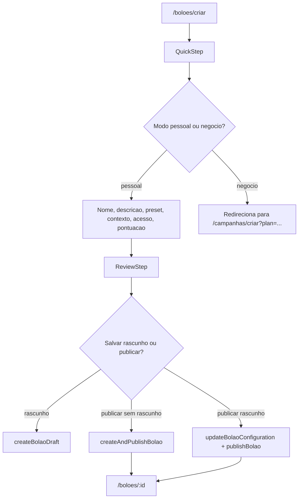
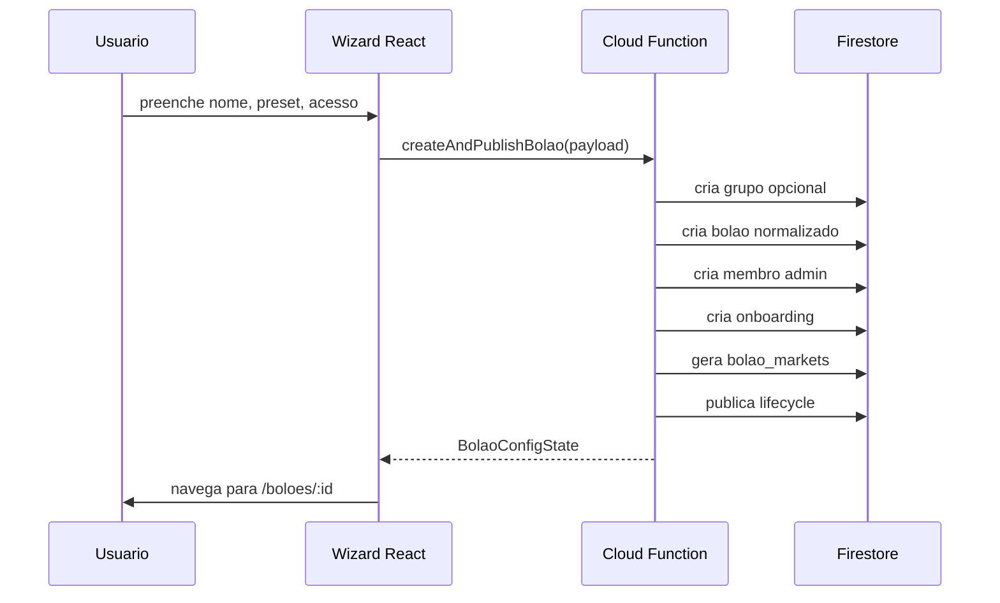
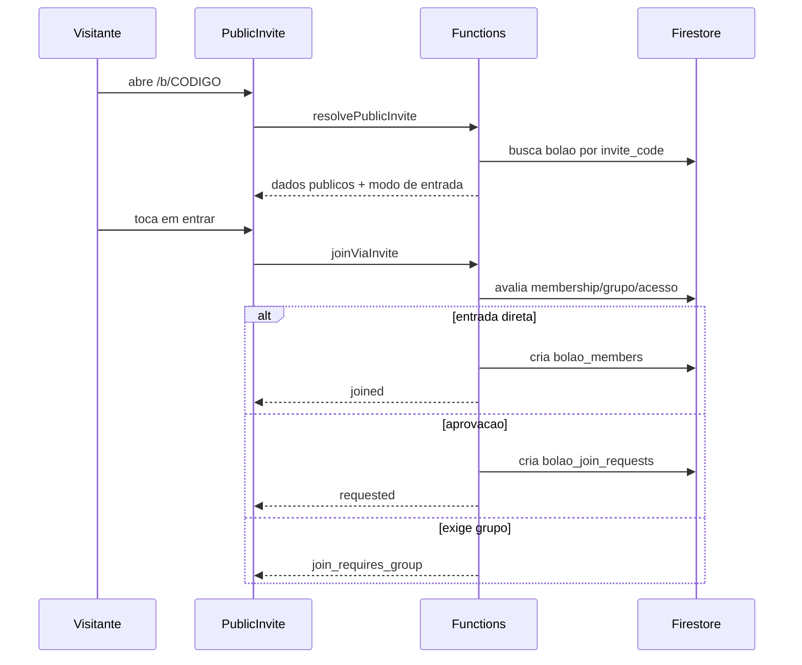
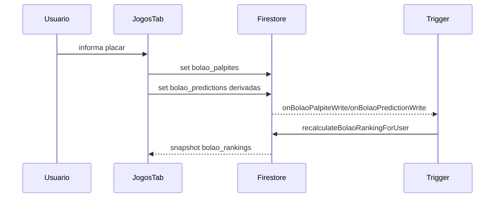

# Sistema de Boloes do ArenaCopa

Atualizado em: 2026-04-28  
Escopo: frontend React, Firebase Firestore, Firebase Cloud Functions, regras de seguranca e fluxos sociais de entrada/convite.

## 1. Visao Geral

O sistema de boloes do ArenaCopa permite que usuarios criem competicoes privadas ou publicas para palpitar em jogos e mercados de campeonato, convidem participantes por link/codigo, acompanhem ranking em tempo real, gerenciem membros e, quando houver combinados financeiros externos, registrem status de pagamento sem que o app processe dinheiro.

Hoje existem dois caminhos tecnicos convivendo:

1. **Modelo moderno, orientado por configuracao**
   - Criacao por wizard em `src/features/boloes/create`.
   - Operacoes sensiveis via Cloud Functions em `functions/bolao-config`.
   - Documento de bolao com secoes estruturadas: `presentation`, `context`, `access_policy`, `competition_rules`, `finance_rules`, `lifecycle`, `integrity`.
   - Suporte a rascunho, publicacao, bloqueio estrutural e auditoria.

2. **Modelo legado/direto**
   - Escrita direta em colecoes Firestore por alguns componentes, especialmente `useCreateBolao`, `BolaoRapido`, `JogosTab` e `CaixinhaPanel`.
   - Usa campos achatados como `name`, `category`, `is_paid`, `scoring_rules`, `status`, `invite_code`.
   - Mantem compatibilidade com `bolao_palpites`, `bolao_extra_bets` e `bolao_champion_predictions`.

O backend moderno normaliza os documentos para manter compatibilidade com a UI antiga: mesmo que um bolao tenha `presentation.name`, tambem recebe `name`; mesmo que tenha `finance_rules.finance_mode`, tambem recebe `is_paid`, `entry_fee`, `payment_details` e `prize_distribution`.

## 2. Principais Entrypoints

### Rotas

| Rota | Tela | Funcao |
|---|---|---|
| `/boloes` | `src/pages/Boloes.tsx` | Lista meus boloes, solicitacoes pendentes, descobertas publicas e entrada por codigo. |
| `/boloes/criar` | `src/pages/CriarBolao.tsx` | Abre o wizard de criacao em `BolaoCreateWizard`. |
| `/boloes/rapido` | `src/pages/BolaoRapido.tsx` | Fluxo simplificado de bolao de jogo unico. |
| `/boloes/:id` | `src/pages/BolaoDetail.tsx` | Detalhe do bolao, palpites, ranking, pessoas e resumo/admin. |
| `/b/:inviteCode` | `src/pages/PublicInvite.tsx` | Convite publico por codigo/link, com entrada direta, solicitacao ou gate por grupo. |
| `/pools`, `/pools/create`, `/pools/:id`, `/criar-bolao` | `src/App.tsx` | Redirecionamentos legados para as rotas atuais. |

### Servicos frontend

| Arquivo | Responsabilidade |
|---|---|
| `src/services/boloes/bolao-config.service.ts` | Cliente HTTP para Cloud Functions de criacao, publicacao, edicao, lifecycle, membros e pagamentos. |
| `src/services/boloes/bolao-listing.service.ts` | Busca cards de boloes do usuario via `listUserBoloes`. |
| `src/services/boloes/bolao-market.service.ts` | Lista templates, cria mercados por formato/jogo e salva resultado oficial de mercado. |
| `src/services/boloes/bolao-prediction.service.ts` | Salva predicoes modernas em `bolao_predictions`. |
| `src/services/boloes/bolao.service.ts` | Salva palpite legado em `bolao_palpites` e delega operacoes de membro/pagamento. |
| `src/services/groups/group-access.service.ts` | Entrada por convite, solicitacao, aprovacao e rejeicao para grupos e boloes. |
| `src/services/public-invite/public-invite.service.ts` | Resolve convite publico de bolao ou grupo sem exigir autenticacao. |
| `src/utils/bolao-share.ts` | Gera URL, texto de WhatsApp e nome de arquivo de QR/poster. |

### Cloud Functions

| Function | Autenticacao | Responsabilidade |
|---|---:|---|
| `resolvePublicInvite` | Publica | Resolve dados publicos de convite de bolao/grupo por codigo. |
| `createBolaoDraft` | Sim | Cria rascunho e inicializa membro admin, onboarding e mercados. |
| `createAndPublishBolao` | Sim | Cria e publica em uma chamada; tambem pode criar grupo junto. |
| `updateBolaoConfiguration` | Sim | Atualiza secoes editaveis com controle de `config_version`. |
| `publishBolao` | Sim | Publica rascunho, cria snapshot e muda lifecycle para `published`. |
| `duplicateBolao` | Sim | Cria rascunho duplicado a partir de snapshot publicado ou rascunho. |
| `alterBolaoPresentation` | Sim | Altera nome, descricao, emoji/mensagem visual. |
| `finishBolao`, `archiveBolao`, `deleteBolao` | Sim | Operacoes de ciclo de vida. |
| `removePoolMember`, `leaveBolao` | Sim | Saida/remocao de participantes com regras de protecao. |
| `updatePoolMemberPaymentStatus` | Sim | Admin altera status de pagamento externo. |
| `submitPoolMemberPaymentProof` | Sim | Participante envia comprovante textual e aceite de premiacao. |
| `requestBolaoJoin`, `approveBolaoJoin`, `rejectBolaoJoin`, `joinViaInvite` | Sim | Fluxos sociais de entrada e aprovacao. |
| `listUserBoloes` | Sim | Lista meus boloes, pendencias e descoberta publica. |

### Triggers Firestore

| Trigger | Quando roda | Efeito |
|---|---|---|
| `onMatchResultUpdated` | `matches/{matchId}` atualizado para finalizado ou score final alterado | Calcula pontos de palpites legados e mercados de partida; recalcula ranking. |
| `onBolaoMarketWrite` | `bolao_markets/{marketId}` criado/alterado | Resolve mercados de fase/torneio/especiais quando ha resultado oficial. |
| `onNewBolaoMember` | Novo `bolao_members/{memberId}` | Inicializa linha em `bolao_rankings` e cria atividade. |
| `onBolaoPalpiteWrite` | Escrita em `bolao_palpites` | Recalcula ranking e registra atividade. |
| `onBolaoPredictionWrite` | Escrita em `bolao_predictions` | Recalcula ranking e registra atividade. |

## 3. Modelo de Dados

### `boloes`

Documento principal do bolao.

Campos modernos:

```ts
{
  id: string;
  creator_id: string;
  schema_version: 2;
  presentation: {
    name: string;
    description: string;
    emoji: string;
    invite_message: string;
  };
  context: {
    group_binding_mode: "none" | "linked_discovery" | "group_gated";
    grupo_id: string | null;
  };
  access_policy: {
    join_mode: "private_invite" | "public_open";
    visibility: "private" | "public";
    admission_mode?: "approval" | "direct_code_or_invite" | "direct_open";
  };
  competition_rules: {
    pool_type: string;
    format: "classic" | "detailed" | "knockout" | "tournament" | "strategic";
    scoring_mode: "default" | "custom" | "exclusive";
    markets: string[];
    scoring_rules: {
      exact: number;
      winner: number;
      draw: number;
      participation?: number;
    };
  };
  finance_rules: {
    finance_mode: "free" | "paid_external";
    entry_fee_amount: number | null;
    currency: "BRL";
    distribution_model: string;
    distribution_custom_text: string;
    payment_details: string;
  };
  lifecycle: {
    status: "draft" | "published" | "live" | "finished" | "archived" | "deleted";
    published_at?: string | null;
    finished_at?: string | null;
    archived_at?: string | null;
    deleted_at?: string | null;
  };
  integrity: {
    is_structure_locked: boolean;
    structure_locked_at?: string | null;
    structure_lock_reason?: string | null;
    lock_trigger?: string | null;
    config_version: number;
    published_snapshot?: object | null;
  };
  editable_sections: {
    presentation: boolean;
    context: boolean;
    access_policy: boolean;
    competition_rules: boolean;
    finance_rules: boolean;
    operation?: boolean;
  };
  metrics: {
    accepted_invite_count: number;
    approved_request_count: number;
    reserved_seat_count: number;
  };
}
```

Campos legados/compatibilidade:

```ts
{
  name: string;
  description: string | null;
  avatar_url: string | null;
  category: "public" | "private";
  is_paid: boolean;
  entry_fee: number | null;
  payment_details: string | null;
  prize_distribution: string | null;
  grupo_id: string | null;
  format_id: string;
  scoring_mode: string;
  scoring_rules: object;
  visibility_mode: "hidden_until_deadline" | "visible_after_save" | "always_hidden";
  cutoff_mode: "per_match" | "per_phase" | "manual";
  status: "draft" | "open" | "active" | "finished" | "deleted";
  invite_code: string;
}
```

### `bolao_members`

Associa usuarios a boloes.

```ts
{
  bolao_id: string;
  user_id: string;
  role: "admin" | "member";
  membership_status?: "active" | "left" | "removed" | "withdrawn_by_owner";
  payment_status?: "pending" | "paid" | "exempt" | "confirmed" | "waived" | "not_required";
  payment_proof_text?: string | null;
  payment_proof_status?: "pending" | "submitted" | "validated" | null;
  payment_proof_submitted_at?: string | null;
  prize_agreement_accepted?: boolean | null;
  prize_agreement_status?: "pending" | "submitted" | "validated" | null;
  invite_code?: string | null;
  joined_at: string;
  created_at: string;
  updated_at: string;
}
```

ID padrao: `${userId}_${bolaoId}`.

### `bolao_join_requests`

Solicitacoes pendentes de entrada.

```ts
{
  bolao_id: string;
  user_id: string;
  request_status: "pending" | "approved" | "rejected";
  invite_code?: string | null;
  created_at: string;
  updated_at: string;
}
```

Criacao, aprovacao e rejeicao sao server-owned via Functions.

### `bolao_markets`

Mercados modernos gerados a partir de templates e formato do bolao.

```ts
{
  id: string;
  bolao_id: string;
  template_id: string;
  slug: string;
  scope: "match" | "phase" | "tournament" | "special";
  title: string;
  description: string;
  help_text?: string;
  match_id?: string | null;
  phase_id?: string | null;
  group_id?: string | null;
  is_required: boolean;
  opens_at?: string | null;
  closes_at?: string | null;
  status: "open" | "closed" | "resolved";
  points_exact: number;
  points_partial: number;
  multiplier: number;
  supports_power_play: boolean;
  supports_confidence: boolean;
  order_index: number;
  prediction_type: "single_choice" | "score" | "number" | "multi_choice" | "team";
  resolution_value?: unknown;
  resolution_meta?: object | null;
  resolved_at?: string | null;
  resolved_by?: string | null;
}
```

IDs:

- Mercado por jogo: `${bolaoId}_${templateId}_${matchId}`
- Mercado global/fase/torneio: `${bolaoId}_${templateId}_${orderIndex}`

### `bolao_predictions`

Predicoes modernas por mercado.

```ts
{
  id: string;
  bolao_id: string;
  market_id: string;
  user_id: string;
  prediction_value: string | number | boolean | string[] | object | null;
  prediction_meta?: object | null;
  points_awarded?: number | null;
  resolved: boolean;
  created_at: string;
  updated_at: Timestamp | string;
}
```

ID padrao: `${userId}_${bolaoId}_${marketId}`.

### `bolao_palpites`

Palpites legados por partida, ainda usados pelo fluxo de jogos e ranking.

```ts
{
  id?: string;
  bolao_id: string;
  user_id: string;
  match_id: string;
  home_score: number | null;
  away_score: number | null;
  points?: number | null;
  type?: "exact" | "winner" | "draw" | "miss";
  is_power_play?: boolean;
  is_exact?: boolean;
  created_at?: string;
  updated_at?: Timestamp | string;
}
```

Ha dois padroes de ID no codigo:

- `saveBolaoPalpite`: `${userId}_${bolaoId}_${matchId}`
- `JogosTab`: `${userId}_${matchId}_${bolaoId}`

Esse ponto merece padronizacao futura.

### `bolao_rankings`

Ranking server-owned.

```ts
{
  user_id: string;
  bolao_id: string;
  total_points: number;
  exact_matches: number;
  correct_results: number;
  draws: number;
  palpites_count: number;
  match_points: number;
  phase_points: number;
  tournament_points: number;
  special_points: number;
  points_breakdown: {
    match: number;
    phase: number;
    tournament: number;
    special: number;
  };
  rank: number;
  created_at: Timestamp;
  updated_at: Timestamp;
}
```

### Outras colecoes

| Colecao | Uso |
|---|---|
| `bolao_activity` | Feed de eventos do bolao: membro entrou, palpite salvo, mercado resolvido. |
| `bolao_onboarding_state` | Estado individual do tour: intro, scoring, markets, ranking. |
| `bolao_extra_bets` | Espelho legado para extras como campeao e artilheiro. |
| `bolao_champion_predictions` | Predicao legada de campeao. |
| `bolao_audit` | Auditoria server-owned de configuracao, lifecycle, membros e pagamento. |
| `matches` | Fonte dos jogos usada para gerar mercados e resolver resultados. |
| `grupos`, `grupo_members` | Base de grupos vinculados aos boloes. |

## 4. Formatos de Bolao

Definidos em `src/data/bolaoFormats.ts`.

| Formato | Habilitado | Mercados default | Perfil |
|---|---:|---|---|
| `classic` | Sim | `match_winner`, `exact_score`, `champion` | Casual, rapido. |
| `detailed` | Sim | Vencedor, placar, gols por time, total de gols, ambos marcam, primeiro a marcar, campeao, artilheiro | Mais completo. |
| `knockout` | Sim | Classificados, semifinalistas, finalistas, campeao, placar exato | Mata-mata. |
| `tournament` | Nao | Lider/vice de grupo, classificados, semifinalistas, finalistas, campeao, artilheiro, defesa, surpresa, total de gols | Hardcore. |
| `strategic` | Nao | Vencedor, power play, confidence, survivor, campeao | Competitivo/estrategico. |

## 5. Templates de Mercado

Definidos em `src/data/bolaoMarketTemplates.ts` e espelhados parcialmente em `functions/bolao-config/market-sync.js`.

### Mercado de partida (`scope: match`)

| Slug | Tipo | Pontos | Observacao |
|---|---|---:|---|
| `match_winner` | `single_choice` | 3 | Time vencedor ou empate. |
| `exact_score` | `score` | 10 | Placar exato. |
| `home_goals` | `number` | 4 | Gols do mandante. |
| `away_goals` | `number` | 4 | Gols do visitante. |
| `total_goals` | `number` | 4 | Total de gols. |
| `both_score` | `single_choice` | 2 | Ambos marcam: sim/nao. |
| `first_team_to_score` | `team` | 3 | Primeiro time a marcar ou nenhum. |

### Mercado de fase (`scope: phase`)

| Slug | Tipo | Pontos exatos | Parcial |
|---|---|---:|---:|
| `group_winner` | `team` | 8 | 0 |
| `group_runner_up` | `team` | 8 | 0 |
| `qualified_teams` | `multi_choice` | 8 | 4 |
| `quarterfinalists` | `multi_choice` | 10 | 5 |
| `semifinalists` | `multi_choice` | 12 | 6 |
| `finalists` | `multi_choice` | 12 | 6 |

### Mercado de torneio (`scope: tournament`)

| Slug | Tipo | Pontos exatos | Parcial |
|---|---|---:|---:|
| `champion` | `team` | 20 | 0 |
| `runner_up` | `team` | 10 | 0 |
| `top_scorer` | `single_choice` | 15 | 0 |
| `best_attack` | `team` | 12 | 0 |
| `best_defense` | `team` | 12 | 0 |
| `surprise_team` | `team` | 10 | 0 |
| `tournament_total_goals` | `number` | 10 | 5 |

### Mercado especial (`scope: special`)

| Slug | Tipo | Pontos/multiplicador |
|---|---|---|
| `power_play` | `single_choice` | Multiplicador 2. |
| `confidence_pick` | `number` | Peso de confianca. |
| `survivor_pick` | `team` | 6 pontos. |
| `bracket_pick` | `multi_choice` | 20 exatos, 10 parcial. |

## 6. Criacao de Bolao

### Wizard moderno

Arquivos:

- `src/features/boloes/create/BolaoCreateWizard.tsx`
- `src/features/boloes/create/useBolaoCreateFlow.ts`
- `CreateBolaoQuickStep.tsx`
- `CreateBolaoContextStep.tsx`
- `CreateBolaoRulesStep.tsx`
- `CreateBolaoAdmissionStep.tsx`
- `CreateBolaoReviewStep.tsx`

Fluxo real atual:



Estado do wizard:

```ts
{
  audienceMode: "personal" | "business";
  contextMode: "standalone" | "existing_group" | "new_group";
  selectedGrupoId: string | null;
  accessMode: "approval" | "public" | "group_gated";
  financeMode: "free" | "paid_external";
  selectedTypeId: "rapid" | "complete" | "paid";
  formatId: BolaoFormatSlug;
  selectedMarketIds: MarketTemplateSlug[];
  scoringRules: ScoringRules;
  scoringMode: "default" | "exclusive";
  name: string;
  description: string;
  emoji: string;
}
```

Presets de pontuacao:

| Preset | Exato | Vencedor | Empate | Participacao |
|---|---:|---:|---:|---:|
| `standard` | 10 | 3 | 3 | 1 |
| `risky` | 20 | 5 | 5 | 0 |
| `conservative` | 5 | 2 | 2 | 1 |

Mapeamento de tipo:

| Tipo | Formato | Preset |
|---|---|---|
| `rapid` | `classic` | `conservative` |
| `complete` | `detailed` | `standard` |
| `paid` | `classic` | `risky` |

### Criacao por Cloud Function

No backend:

1. `buildDraftBolaoDocument` monta o documento normalizado.
2. `createDraft` grava `boloes/{id}`.
3. Cria membro admin em `bolao_members/{userId}_{bolaoId}`.
4. Cria onboarding em `bolao_onboarding_state/{userId}_{bolaoId}`.
5. `syncBolaoMarkets` cria `bolao_markets` com base em `competition_rules.markets` e `matches`.
6. Se publicado, `buildPublishUpdate` muda lifecycle para `published` e salva `published_snapshot`.

### Bolao rapido

Arquivo: `src/pages/BolaoRapido.tsx`.

Fluxo:

1. Busca jogos entre agora menos 2h e os proximos 3 dias.
2. Usuario escolhe um jogo.
3. Nome e preenchido automaticamente com os times.
4. `useCreateBolao` cria um bolao privado, classico, de um jogo so.
5. Tela de sucesso mostra codigo e botoes de WhatsApp/compartilhamento.

Ponto de atencao: o codigo atual usa `selectedMarketIds: ["score"]`, mas `score` nao existe em `MarketTemplateSlug`; o slug esperado para placar e `exact_score`. Isso pode quebrar geracao de mercados dependendo da validacao/compilacao.

## 7. Entrada, Convite e Descoberta

### Convite publico

`buildBolaoInviteUrl(inviteCode)` gera:

```txt
/b/{CODE}?action=join&utm_source=whatsapp&utm_medium=share&utm_campaign=bolao_invite
```

`PublicInvite.tsx`:

1. Chama `resolvePublicBolaoInvite(inviteCode)`.
2. Se usuario ja for membro ativo, redireciona para `/boloes/:id`.
3. Define o modo de CTA:
   - `group_first`: bolao exige entrada previa em grupo.
   - `direct`: entrada direta.
   - `request`: entrada por solicitacao/aprovacao.
4. Se a URL tiver `?action=join`, tenta entrada automatica via `joinViaInvite`.

### Decisao de entrada no backend

Em `functions/group-access/contract.js`, `getBolaoJoinDecision` decide:

- Se bolao deletado: bloqueia com `not_found`.
- Se ja e membro: `already_member`.
- Se `group_binding_mode === "group_gated"` e usuario nao esta no grupo: bloqueia com `join_requires_group`.
- Se `join_mode === "public_open"` e `admission_mode === "direct_open"`: entrada direta.
- Se `join_mode === "public_open"` e `admission_mode === "direct_code_or_invite"` com codigo correto: entrada direta.
- Caso contrario: cria solicitacao.

### Tela `/boloes`

`Boloes.tsx` usa `listUserBoloes` para montar:

- `myBoloes`: boloes onde o usuario participa.
- `pendingRequests`: solicitacoes pendentes.
- `discoverBoloes`: boloes publicos/discoverable.

Tambem permite colar codigo manualmente e chamar `joinViaInvite`.

## 8. Detalhe do Bolao

Arquivo principal: `src/pages/BolaoDetail.tsx`.

### Guardas de acesso

Ao carregar:

1. Verifica se existe `bolao_members/{userId}_{bolaoId}`.
2. Recusa se `membership_status` for `left`, `removed` ou `withdrawn_by_owner`.
3. Verifica se `boloes/{bolaoId}` existe.
4. Recusa se lifecycle/status for `deleted`.
5. Carrega dados do bolao e assina snapshots de membros, pedidos, palpites, mercados, predicoes, atividades e onboarding.

### Abas

| Aba | Componentes | Conteudo |
|---|---|---|
| `palpites` | `JogosTab`, `PhaseMarketsTab`, `ExtrasTab`, `SpecialMarketsTab` | Jogos, placares, mercados de fase, campeonato e especiais. |
| `ranking` | `RealtimeRankingTab` | Ranking por pontos e breakdown. |
| `pessoas` | `AdmissionInbox`, `PublicPalpitesTab`, `MembrosTab` | Solicitacoes, palpites publicos e membros. |
| `resumo` | `OverviewTab`, `CaixinhaPanel`, `GrupoLinkPanel` | Visao geral, financeiro/premiacao e vinculo com grupo. |

## 9. Palpites e Predicoes

### Placar de jogo

`JogosTab`:

- Carrega todos os jogos de `matches`.
- Assina `bolao_palpites` do usuario.
- Se houver mercados modernos, agrupa `bolao_markets` por `match_id`.
- Ao salvar placar, escreve:
  - `bolao_palpites/{id}` com `home_score`, `away_score`.
  - `bolao_predictions` derivadas para mercados como:
    - `exact_score`: `{ home, away }`
    - `match_winner`: time vencedor ou `draw`
    - `home_goals`
    - `away_goals`
    - `total_goals`
    - `both_score`: `yes`/`no`
- Se existir `first_team_to_score`, salva predicao separada.

### Modo exclusivo

Se `bolao.scoring_mode === "exclusive"`, `JogosTab` carrega todos os palpites do bolao e mostra uma grade de placares 0x0 a 4x4. Um placar ja escolhido por outro participante fica bloqueado visualmente.

Ponto de atencao: o bloqueio e visual e baseado em snapshot. A escrita do palpite nao usa transacao/constraint server-side para impedir corrida entre dois usuarios escolhendo o mesmo placar ao mesmo tempo.

### Mercados de fase

`PhaseMarketsTab`:

- Permite selecionar times por grupo.
- Limites:
  - `qualified_teams`: ate 16.
  - `quarterfinalists`: ate 8.
  - `semifinalists`: ate 4.
  - `finalists`: ate 2.
  - demais: 1.
- Admin pode definir resultado oficial chamando `saveBolaoMarketResolution`.

### Mercados de torneio/extras

`ExtrasTab`:

- Filtra `scope === "tournament"`.
- Permite editar `champion`, `runner_up`, `surprise_team`, `best_attack`, `best_defense`, `top_scorer`, `tournament_total_goals`.
- Para `champion` e `top_scorer`, tambem grava espelho legado em `bolao_extra_bets`.
- Admin pode resolver resultado oficial.

### Mercados especiais

`SpecialMarketsTab`:

- `survivor_pick`: selecao de time.
- `confidence_pick`: range numerico 1 a 10.
- `power_play`: habilitar/desabilitar.
- `bracket_pick`: usa `BracketPickCard`.
- Admin pode resolver resultado oficial.

## 10. Pontuacao e Ranking

### Pontuacao legada no frontend

`src/utils/bolaoUtils.ts` implementa `calculatePoints`:

- Sem jogo finalizado: 0.
- Placar exato: `rules.exact`.
- Resultado correto com vencedor: `rules.winner`.
- Empate correto com placar errado: `rules.draw`.
- Participacao: inicia com `rules.participation`.
- Power play dobra pontos quando `is_power_play` e pontos > 0.

### Pontuacao legada no backend

`onMatchResultUpdated` recalcula `bolao_palpites` quando o jogo finaliza. Ele usa constantes globais:

```js
const SCORING = {
  EXACT: 5,
  WINNER: 3,
  DRAW: 2,
};
```

Ponto de atencao: esse trigger nao consulta `bolao.scoring_rules`. Portanto, palpites legados podem pontuar diferente das regras configuradas no bolao se a UI exibir presets como 10/3/3/1 ou 20/5/5/0.

### Pontuacao moderna

Para mercados modernos:

- Partidas sao resolvidas por `onMatchResultUpdated`, comparando `prediction_value` com o resultado do jogo.
- Mercados nao-partida sao resolvidos por `onBolaoMarketWrite`, quando o admin define `resolution_value` e `status === "resolved"`.
- `multi_choice`:
  - Lista identica: `points_exact`.
  - Acertos parciais: `hits * points_partial`, limitado por `points_exact`.
  - Sem acertos: 0.
- `score`:
  - Placar identico: `points_exact`.
  - Caso contrario: 0.
- Escalares (`team`, `single_choice`, `number`, boolean normalizado):
  - Igual ao oficial: `points_exact`.
  - Diferente: 0.

### Ranking

`recalculateBolaoRankingForUser`:

1. Busca `bolao_palpites`, `bolao_predictions` e verifica se existem mercados modernos.
2. Se nao houver mercados modernos, soma pontos legados de `bolao_palpites`.
3. Soma `points_awarded` das predicoes modernas com breakdown por `scope`.
4. Atualiza `bolao_rankings/{userId}_{bolaoId}`.

`RealtimeRankingTab`:

- Assina `bolao_rankings` por `bolao_id`.
- Ordena por `total_points desc`.
- Busca perfis publicos.
- Mostra podio, lista completa, breakdown e legenda.

## 11. Membros, Pagamentos e Premiacao

### Membros

`MembrosTab` permite:

- Participante sair do bolao via `leaveBolao`.
- Admin remover participante via `removePoolMember`.
- Admin alternar pagamento entre `pending`, `paid`, `exempt`.
- Participante enviar comprovante textual e aceite da premiacao.
- Admin confirmar comprovante, marcando status como pago/validado.

### Protecoes de remocao/saida

No backend:

- Criador nao pode sair do proprio bolao.
- Membro protegido se:
  - lifecycle for `live`, `finished` ou `archived`;
  - ja tiver predicao (`has_prediction`);
  - pagamento confirmado/pago.
- Em `draft`, remocao e permitida.
- Em `published`, remocao exige `reason_code` e pode ser bloqueada se membro ja tiver predicao ou pagamento.

### Financeiro externo

O sistema nao processa pagamento nem split financeiro. O modo `paid_external` registra:

- valor de entrada;
- detalhes de pagamento;
- texto de rateio/premiacao;
- status e comprovantes dos participantes.

`CaixinhaPanel` permite ao admin configurar:

- tipo de premio (`money`, `beer`, `food`, `task`, `glory`, `custom`);
- descricao;
- chave Pix;
- caixinha habilitada;
- valor por pessoa;
- mensagem de WhatsApp com instrucoes.

Ponto de atencao: `CaixinhaPanel` escreve direto em `boloes` com campos legados (`prize_type`, `pix_key`, `caixinha_enabled`). As regras Firestore permitem apenas updates de apresentacao via `isPresentationOnlyBolaoUpdate`; se esses campos nao estiverem contemplados nessa funcao, a gravacao pode falhar para usuarios/clientes comuns.

## 12. Lifecycle, Integridade e Edicao

### Estados

| Estado | Significado |
|---|---|
| `draft` | Rascunho editavel. |
| `published` | Publicado, aceita participantes conforme politica. |
| `live` | Competicao em andamento. |
| `finished` | Competicao encerrada. |
| `archived` | Encerrada e arquivada. |
| `deleted` | Apagada logicamente. |

Compatibilidade legado:

- `live` vira `active`.
- `finished`, `archived`, `deleted` permanecem iguais.
- Demais estados viram `open`.

### Bloqueio estrutural

`deriveFacts` e `recomputeDerivedState` definem `integrity.is_structure_locked` quando:

- existe participante externo ativo;
- algum membro tem predicao;
- primeiro pagamento foi confirmado;
- lifecycle esta em `live`, `finished`, `archived` ou `deleted`;
- ja havia lock anterior.

Secoes editaveis:

| Secao | Regra |
|---|---|
| `presentation` | Sempre editavel, exceto deletado. |
| `context` | Editavel em draft ou antes de participante/expectativa publica. |
| `access_policy` | Editavel em draft ou antes de participante/expectativa publica. |
| `competition_rules` | So em draft. |
| `finance_rules` | So em draft. |
| `operation` | Permitida exceto deletado. |

### Controle de concorrencia

`updateBolaoConfiguration` e `publishBolao` exigem `expected_config_version`. Se a versao enviada divergir da atual, o backend retorna `config_conflict`.

## 13. Compartilhamento

### Convite

`buildBolaoWhatsAppMessage` gera texto com:

- nome do bolao;
- codigo;
- link direto;
- instrucoes de entrada;
- contexto de turma/bar/evento.

### Palpite individual

`JogosTab` usa:

- `ShareCardGenerator`;
- `html-to-image`;
- Web Share API;
- clipboard;
- download de PNG.

### Ranking

`RealtimeRankingTab` monta texto com top 3 e posicao do usuario, usando `navigator.share` ou clipboard.

## 14. Internacionalizacao

Textos de bolao ficam principalmente em:

- `public/locales/pt-BR/bolao.json`
- `public/locales/en/bolao.json`
- `public/locales/es/bolao.json`

Varias telas usam `useTranslation("bolao")`. Algumas telas novas ainda contem textos hardcoded em portugues, especialmente no fluxo de criacao rapido/social e em partes de membros/pagamento.

## 15. Regras Firestore

Resumo das regras relevantes em `firestore.rules`:

| Colecao | Leitura | Escrita |
|---|---|---|
| `boloes` | Usuario autenticado se bolao publico, membro ou criador. | Criador cria. Update direto so se for apresentacao. Delete por criador. |
| `bolao_members` | Proprio usuario ou membro do bolao. | Cliente so cria admin inicial em condicoes restritas. Update/delete bloqueados. |
| `bolao_join_requests` | Proprio solicitante ou criador do bolao. | Bloqueado no cliente; server-owned. |
| `bolao_markets` | Membro ou criador. | Criador pode criar/alterar/deletar. |
| `bolao_activity` | Membro ou criador. | Bloqueado; backend escreve. |
| `bolao_extra_bets` | Dono ou criador. | Dono cria/atualiza; dono ou criador deleta. |
| `bolao_palpites` | Dono ou membro do bolao. | Dono cria/atualiza enquanto `points == null`; dono deleta. |
| `bolao_predictions` | Dono ou membro do bolao. | Dono cria/atualiza enquanto `resolved == false` e sem alterar campos protegidos. |
| `bolao_champion_predictions` | Dono ou membro. | Dono cria/atualiza. |
| `bolao_rankings` | Membro do bolao. | Bloqueado; Admin SDK escreve. |
| `bolao_onboarding_state` | Proprio usuario. | Proprio usuario cria/atualiza/deleta. |
| `bolao_audit` | Bloqueado. | Bloqueado no cliente; backend escreve. |

## 16. Relacao com Grupos

Um bolao pode:

1. Ser independente (`group_binding_mode: "none"`).
2. Estar vinculado para descoberta (`linked_discovery`).
3. Exigir entrada no grupo antes do bolao (`group_gated`).

No wizard:

- `standalone`: sem grupo.
- `existing_group`: usa `selectedGrupoId`.
- `new_group`: cria grupo junto no publish.

`GrupoLinkPanel` no detalhe permite ao criador vincular/desvincular grupo.

`FeaturedBolaoCard` e fluxos de grupos exibem bolao associado ao grupo.

## 17. Telemetria

Eventos usados:

- `trackSocialEvent("pool_create_started")`
- `trackSocialEvent("pool_create_completed")`
- `trackSocialEvent("step_abandoned")`
- `trackSocialEvent("join_cta_viewed")`
- `trackSocialEvent("join_direct_success")`
- `trackSocialEvent("join_requested")`
- `trackSocialEvent("approval_completed")`
- `trackSocialEvent("approval_latency")`
- `trackBolaoConfigEvent("draft_created")`
- `trackBolaoConfigEvent("pool_published")`

## 18. Testes Existentes

Arquivos relevantes:

| Arquivo | Cobertura |
|---|---|
| `functions/test/bolao-config.contract.test.js` | Contrato de lifecycle, editabilidade e integridade. |
| `functions/test/bolao-config.handlers.test.js` | Normalizacao e handlers de configuracao. |
| `functions/test/bolao-config.market-sync.test.js` | Geracao/sincronizacao de mercados. |
| `functions/test/bolao-config.migration.test.js` | Migracao/normalizacao. |
| `functions/test/group-access.contract.test.js` | Regras de entrada em grupo/bolao. |
| `src/test/integration/CriarBolaoWizard.test.tsx` | Wizard de criacao. |
| `src/test/integration/BolaoEditFlow.test.tsx` | Edicao de bolao. |
| `src/test/integration/GrupoBolaoEntryPoints.test.tsx` | Entrypoints grupo/bolao. |
| `src/test/integration/firestore-bolao.rules.test.ts` | Regras Firestore. |
| `src/test/integration/bolao-config.service.test.ts` | Cliente de configuracao. |
| `src/test/unit/bolaoUtils.test.ts` | Calculo legado de pontos. |
| `src/test/unit/bolao-listing.test.ts` | Helpers/listagem. |
| `src/test/unit/bolao-share.test.ts` | Compartilhamento. |

## 19. Fluxos End-to-End

### Criar bolao pessoal e publicar



### Entrar por convite



### Salvar palpite e atualizar ranking



## 20. Pontos de Atencao Tecnicos

1. **Slug invalido em `BolaoRapido`**
   - Usa `selectedMarketIds: ["score"]`.
   - O slug correto no sistema moderno e `exact_score`.

2. **Pontuacao legada inconsistente**
   - Backend usa `SCORING = { EXACT: 5, WINNER: 3, DRAW: 2 }`.
   - Wizard permite presets diferentes.
   - Pode haver divergencia entre regra exibida e pontuacao calculada para `bolao_palpites`.

3. **Dois padroes de ID para `bolao_palpites`**
   - Pode gerar duplicidade se os dois helpers forem usados no mesmo fluxo.

4. **Mercados duplicados entre frontend e backend**
   - `src/data/bolaoMarketTemplates.ts` tem lista mais completa que `functions/bolao-config/market-sync.js`.
   - Se o backend nao reconhecer um template enviado pelo frontend, ele ignora esse mercado.

5. **Escritas diretas ainda coexistem com Functions**
   - O modelo moderno tenta centralizar integridade no backend.
   - Alguns componentes ainda gravam direto em `boloes`, `bolao_palpites`, `bolao_markets` e `bolao_predictions`.

6. **Modo exclusivo sem lock transacional**
   - A UI bloqueia placares ja escolhidos, mas a escrita nao garante exclusividade em corrida simultanea.

7. **Rank field nao e reordenado**
   - `bolao_rankings.rank` e preservado/inicializado como 0.
   - A UI ordena por `total_points`, entao a posicao visual existe, mas o campo `rank` nao representa necessariamente a posicao final.

8. **Lifecycle `live` depende de atualizacao externa**
   - O codigo documentado publica como `published`; a transicao para `live` nao aparece como fluxo central no wizard.

9. **Caixinha pode conflitar com regras**
   - `CaixinhaPanel` faz `updateDoc` direto em campos financeiros/legados.
   - Se regras so permitirem update de apresentacao, a operacao pode ser negada.

## 21. Recomendacoes de Evolucao

1. Padronizar criacao em Cloud Functions e aposentar criacao direta por `useCreateBolao`, ou fazer `useCreateBolao` chamar `createAndPublishBolao`.
2. Unificar `bolao_palpites` com `bolao_predictions`, mantendo legado apenas como migracao.
3. Remover constantes globais de pontuacao do trigger legado e usar `boloes.scoring_rules`.
4. Sincronizar a lista de templates entre frontend e backend a partir de uma fonte unica.
5. Corrigir `BolaoRapido` para usar `exact_score`.
6. Criar constraint transacional para modo `exclusive`.
7. Recalcular e persistir `rank` no backend se esse campo for usado fora da UI.
8. Migrar `CaixinhaPanel` para `finance_rules` + Function dedicada.
9. Cobrir com testes:
   - entrada direta/publica;
   - `group_gated`;
   - pagamento externo;
   - resolucao de mercados;
   - concorrencia do modo exclusivo;
   - compatibilidade de documentos schema v1/v2.

## 22. Mapa Rapido de Arquivos

```txt
src/pages/Boloes.tsx
src/pages/CriarBolao.tsx
src/pages/BolaoDetail.tsx
src/pages/BolaoRapido.tsx
src/pages/PublicInvite.tsx

src/features/boloes/create/*
src/features/boloes/edit/*
src/features/boloes/listing/*
src/features/boloes/shared/*

src/components/copa/bolao/JogosTab.tsx
src/components/copa/bolao/RealtimeRankingTab.tsx
src/components/copa/bolao/MembrosTab.tsx
src/components/copa/bolao/OverviewTab.tsx
src/components/copa/bolao/PublicPalpitesTab.tsx
src/components/copa/bolao/ExtrasTab.tsx
src/components/copa/bolao/GrupoLinkPanel.tsx
src/components/copa/bolao/markets/*
src/components/CaixinhaPanel.tsx
src/components/BolaoExpressSheet.tsx

src/services/boloes/*
src/services/groups/group-access.service.ts
src/services/public-invite/public-invite.service.ts

src/data/bolaoFormats.ts
src/data/bolaoMarketTemplates.ts
src/types/bolao.ts
src/types/bolao-config.ts
src/utils/bolaoUtils.ts
src/utils/bolao-share.ts

functions/bolao-config/*
functions/group-access/*
functions/bolao-listing/*
functions/index.js
firestore.rules
```
